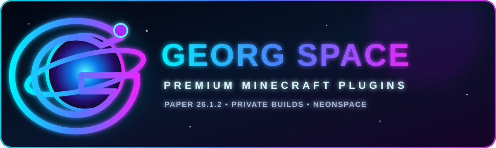
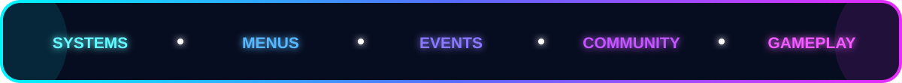
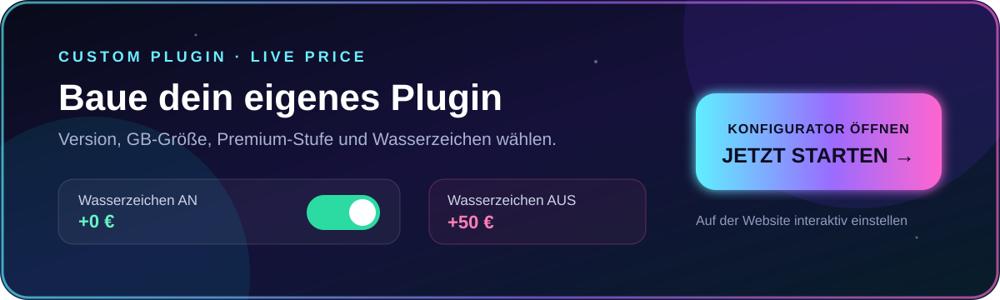

  

  
  
  
  

  

Custom Paper plugins built for modern Minecraft servers.

I create polished server systems, menus, events, community features and custom gameplay for **Paper 26.1.x / 26.1.2**. My projects are developed around real server use on **NeonSpace**.

> **Private commercial plugins:** Source code and JAR files are not hosted publicly on GitHub.

| Plugin | What it does | Price | Status |
| --- | --- | ---: | --- |
| **NeonSpaceCore** | All-in-one menus, rewards, music and server presentation | **€14.99** | 🟢 Available |
| **NeonPlotAddon** | Large PlotSquared expansion with likes, shops, warps and plot tools | **€14.99** | 🟢 Available |
| **NeonSpace Servers** | Minehut-style custom server and world management | **€14.99** | 🟢 Available |
| **NeonTour** | Cinematic, unskippable new-player server tour | **€12.99** | 🟢 Available |
| **NeonAdminAbuse** | Large live-event system with bosses, gifts and visual effects | **€12.99** | 🟢 Available |
| **Neon Crates & Community** | Animated crates plus community systems | **€12.99** | 🟢 Available |
| **NeonCommunity** | Levels, friends, statistics, announcements and chat games | **€10.99** | 🟢 Available |
| **NeonRewards** | AFK rewards, shard shop and custom mining tools | **€9.99** | 🟢 Available |
| **NeonRanks** | Resource-pack rank graphics and TAB integration | **€8.99** | 🟢 Available |
| **NeonMusicMenu** | Music selection and resource-pack integration | **€7.99** | 🟢 Available |
| **NeonNPCs** | Configurable NPCs with GUI and command actions | **€7.99** | 🟢 Available |
| **NeonMenus** | Modern menus, villagers and configurable actions | **€6.99** | 🟢 Available |
| **NeonBlockMenus** | Bind menus and commands to blocks | **€5.99** | 🟢 Available |
| **NeonClans** | Lightweight clan management with configurable branding | **€5.99** | 🟢 Available |
| **FakeTabChat** | Custom TAB/chat presentation package | **€4.99** | 🟢 Available |
| **NeonMusic** | Standalone multi-track server music system | **€4.99** | 🟢 Available |
| **NeonTreadmills** | Region-based treadmills with ranks and economy rewards | **€4.99** | 🟢 Available |
| **DoubleEnderChest** | Persistent 54-slot Ender Chest system | **€2.99** | 🟢 Available |
| **EventCandyPack** | Event-only resource-pack controller | **€2.99** | 🟢 Available |
| **NeonItemShop** | Oraxen and Vanilla item shop with Vault economy | — | 🟣 Coming soon |

<table>
  <tr>
    <td width="50%" align="center">
      
    </td>
    <td width="50%" align="center">
      
    </td>
  </tr>
</table>

  

> **Eigenes Plugin:** Name, Version, Größe und Premium-Stufe auswählen. Mit Georg-Space-Wasserzeichen **+0 €**, ohne Wasserzeichen **+50 €**. Der endgültige Preis wird live auf der Website berechnet.

See [the complete plugin catalog](PLUGINS.md) for features and compatibility.

1. Join the official [Georg Space Discord](https://discord.gg/PHkDvWchU).
2. Open a purchase ticket.
3. Send the plugin name and your Paper/Java version.
4. You receive the exact price and PayPal payment instructions inside the private ticket.
5. After the payment is confirmed, the licensed files are delivered privately.

Never send money to an account posted outside an official purchase ticket.

- Compiled plugin JAR
- Included configuration files
- Setup instructions
- Required resource pack when the product needs one
- One-server-network license
- Installation help through the purchase ticket

Source code is not included unless a separate written agreement says otherwise.

**Georg Space**  
Minecraft Plugin Developer · Founder of NeonSpace · Building custom servers, plugins and websites

Minecraft server: `neonspace.serv.nu`

These are commercial projects. Viewing this repository does not grant permission to copy, redistribute, resell or publish any paid plugin. Read the [commercial license summary](LICENSE.md).

  

